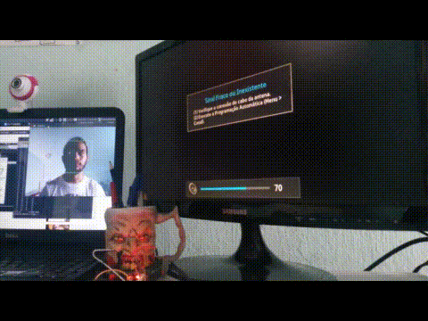

Coruja Remote
=============

Cassio Trindade Batista Coruja Remote is a universal, multimodal remote control developed by FalaBrasil
Group at Federal University of Pará (UFPA), Brazil. Conventional, universal
remote control devices or apps on the smartphone, force the use of hands by the
user, which can be cumbersome or even impossible, specially for people with
special needs. Coruja Remote accepts both voice commands and head poses as input
commands, which turns itself a good -- and maybe the only one -- solution for
visually or motor impaired people.



HPE stands for Head Pose Estimation

Check the project page on Hackaday.IO:    
- https://hackaday.io/project/26830-tv-remote-control-based-on-head-gestures

## Instructions: Compilation and Usage

On `desktop/original/` dir, you may do the following to compile:      
```bash
$ mkdir -p desktop/original/build
$ cd desktop/original/build
$ cmake ..
$ make
```

And to execute:      
```bash
$ ./hpe_remote
```

## To Install OpenCV Dependencies:
```bash
sudo apt-get install \
	build-essential cmake git python-dev python-numpy \
	libgtk2.0-dev pkg-config libavcodec-dev libavformat-dev libswscale-dev \
	libtbb2 libtbb-dev libjpeg-dev libpng-dev libtiff-dev libjasper-dev libdc1394-22-dev \
	gstreamer1.0-plugins-base libgstreamer1.0-0 libgstreamer1.0-dev libgstreamer-plugins-base1.0-* \
	libavresample-dev libavresample1
```

## Citation
If you ever use this code please cite the paper as the following:

> Cassio T. Batista, Erick M. Campos, and Nelson C. Sampaio Neto. 2017. A
> Proposal of a Universal Remote Control System Based on Head Movements. In
> Proceedings of the XVI Brazilian Symposium on Human Factors in Computing
> Systems (IHC 2017). ACM, New York, NY, USA, Article 2, 10 pages. DOI:
> https://doi.org/10.1145/3160504.3160516


```bibtex
@inproceedings{Batista17,
    author    = {Batista, Cassio T. and Campos, Erick M. and Neto, Nelson C. Sampaio},
    title     = {A Proposal of a Universal Remote Control System Based on Head Movements},
    booktitle = {Proceedings of the XVI Brazilian Symposium on Human Factors in Computing Systems},
    series    = {IHC 2017},
    year      = {2017},
    isbn      = {978-1-4503-6377-8},
    location  = {Joinville, Brazil},
    pages     = {2:1--2:10},
    articleno = {2},
    numpages  = {10},
    url       = {http://doi.acm.org/10.1145/3160504.3160516},
    doi       = {10.1145/3160504.3160516},
    acmid     = {3160516},
    publisher = {ACM},
    address   = {New York, NY, USA},
    keywords  = {Assistive Technology, Head pose estimation, mean opinion score, universal remote control},
}
```
